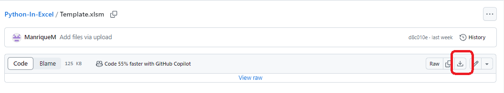

# Python-In-Excel

The [Python in Excel Helper GPT](https://chat.openai.com/g/g-dubFVnxZQ-python-in-excel-helper) bridges the use of ChatGPT code with Python in Excel. Python in Excel executes within Excel through the '=PY' function, opening a window to run Python code. Python runs on the Microsoft Cloud via the Anaconda distribution, with access to a subset of packages tailored for data analysis. For more details on Python in Excel, please visit this [link](https://support.microsoft.com/en-gb/office/get-started-with-python-in-excel-a33fbcbe-065b-41d3-82cf-23d05397f53d).

### Prerequisites for Using This GPT

1. **Download the Template.xlsm:** Included in this repository. To download, [click here](Template.xlsm).

    

    **Note:** The template is a macro-enabled Excel workbook. Macros are typically blocked for web-downloaded files by default. To enable, after downloading:
    - Right-click on the file.
    - Go to `Properties`.
    - Check the box to `Unblock`.

    The file also functions without the macro, but enabling it simplifies usage. The VB script included is open for review.

    

2. **Using the Template:** The file contains 4 tabs:
   - **Instructions:** Details on using the file with the Python in Excel Helper GPT.
   - **Prepare Data:** Assists in preparing sample columns for GPT.
   - **Output:** To input the Python in Excel code.
   - **Notes:** Includes execution details and reference materials.
